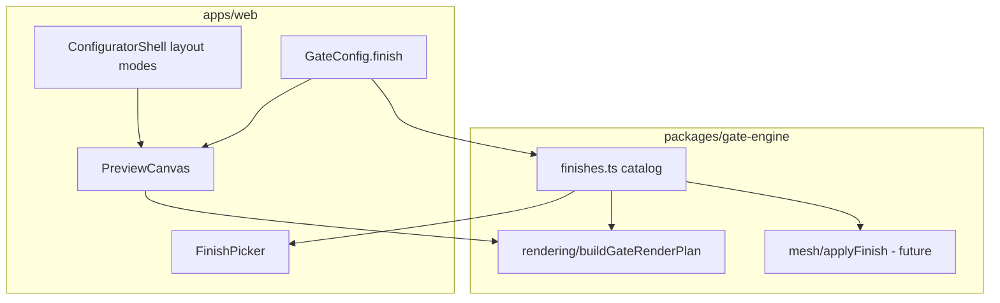

# Configurator — Finish Palette, Orientation UX, and 3D-Safe Preview Plan

Date: 2026-05-20

Purpose: execute the next configurator UX wave without breaking the shared config contract or blocking future on-demand 3D/AR.

Phase 0 baseline:

- `/configurator` stays the public entry.
- `/quote/[shareToken]` stays the default share route.
- `GateConfig.finish` stays the persisted finish field.
- 2D remains the default preview path; 3D/AR stays on-demand and additive.

This plan covers:

1. finish swatch picker in the UI
2. finish-aware 2D schematic preview
3. soft portrait orientation hint
4. phone landscape layout with side-by-side preview and controls
5. preview shell boundaries that keep 3D additive later

---

## Product goals

| Goal | Why |
|---|---|
| User sees finish choice affect the preview | Makes configuration feel real and trustworthy |
| Mobile portrait stays usable | Primary traffic is phone-first |
| Landscape phone gets a better layout | More horizontal space without forcing desktop |
| No fake “performance” messaging | 2D preview is lightweight; do not push users away from mobile |
| 3D remains optional later | ADR 002: lazy-loaded, same `GateConfig`, no Three.js in default bundle |

## Non-goals (this wave)

- No Three.js canvas in the main configurator page
- No AR export work
- No finish pricing multipliers until Marius confirms business data
- No new DB tables for finishes
- No blocking overlay that prevents portrait use
- No “unlock features” copy unless the layout actually changes
- No route, persistence, or share-model change in this wave

---

## Architecture principle (critical for future 3D)

Use one **finish catalog** in `gate-engine`. UI and renderers consume it. Do not duplicate hex values in React components.



Rules:

| Rule | Detail |
|---|---|
| Single finish source | `FinishCode` enum stays in `types.ts`; visual/material definitions live in one engine module |
| 2D uses schematic tokens | Approximate colors only; label as schematic in UI |
| 3D uses material tokens later | Same finish code maps to PBR params in `mesh/shared.ts`, not separate UI enums |
| Preview panel is mode-ready | Shell hosts `2d` now; reserves slot/API for lazy `3d` without rewriting layout |
| Layout modes are explicit | Portrait / landscape-phone / desktop are named modes, not scattered magic breakpoints |
| Config unchanged | `GateConfig.finish` remains the persisted field; no new save format version |

---

## Current gaps (verified)

| Area | Current state | Target state |
|---|---|---|
| Finish UI | `<select>` in `ChooseActPanel` | Swatch picker with labels |
| 2D renderer | Hardcoded ink/grey constants in `rendering.ts` | Uses finish palette from engine |
| Orientation UX | None | Soft dismissible hint in portrait phone |
| Phone landscape | Same as portrait stack | Split preview + controls |
| 3D readiness | No preview abstraction | `PreviewCanvas` contract |

---

## Target file map

### New files (engine)

| File | Purpose |
|---|---|
| `packages/gate-engine/src/finishes.ts` | Canonical finish catalog: labels, 2D schematic tokens, future 3D material tokens |
| `packages/gate-engine/tests/finishes.test.ts` | Catalog integrity + mapping tests |

### Modified files (engine)

| File | Change |
|---|---|
| `packages/gate-engine/src/rendering.ts` | Resolve finish palette at plan build time; remove ad-hoc frame/infill color constants where finish-sensitive |
| `packages/gate-engine/src/index.ts` | Export finish catalog helpers |
| `packages/gate-engine/tests/rendering.test.ts` | Assert different finishes produce different schematic output |

### New files (web)

| File | Purpose |
|---|---|
| `apps/web/src/components/configurator/FinishPicker.tsx` | Touch-friendly swatch grid |
| `apps/web/src/components/configurator/PreviewCanvas.tsx` | Preview host (`mode: 'installation'`, future `'3d'`) |
| `apps/web/src/components/configurator/ConfiguratorOrientationHint.tsx` | Dismissible rotate tip |
| `apps/web/src/hooks/useConfiguratorViewport.ts` | `portrait-phone` / `landscape-phone` / `tablet` / `desktop` |

### Modified files (web)

| File | Change |
|---|---|
| `apps/web/src/lib/configurator/presentation.ts` | Remove duplicated finish labels if moved to engine re-export; keep UI-only copy |
| `apps/web/src/components/configurator/acts/ChooseActPanel.tsx` | Replace finish `<select>` with `FinishPicker` |
| `apps/web/src/components/configurator/ConfiguratorPreview.tsx` | Consume preview panel wrapper or become thin 2D child |
| `apps/web/src/components/configurator/ConfiguratorShell.tsx` | Layout modes + hint + landscape grid |
| `apps/web/src/store/configuratorStore.ts` | Optional: `orientationHintDismissed` if not using standalone localStorage key |

### Not touched in this wave

| Area | Reason |
|---|---|
| `packages/gate-engine/src/pricing.ts` | Finish multipliers still blocked on client data |
| DB / Supabase | No speculative finish schema |
| mesh / Three.js | Future phase per ADR 002 |
| Save/share routes | `GateConfig.finish` unchanged |

---

## Finish catalog design (engine)

Add `packages/gate-engine/src/finishes.ts` with a stable shape:

```ts
export type FinishSchematicTokens = {
  frame: string
  infill: string
  accent: string
  panel: string
  label: string
  strokeMuted: string
}

export type FinishMaterialTokens = {
  // Reserved for future mesh/applyFinish — do not wire to Three.js in this wave
  colorHex: string
  metalness: number
  roughness: number
}

export type FinishDefinition = {
  code: FinishCode
  label: string
  provisional: boolean
  schematic: FinishSchematicTokens
  material: FinishMaterialTokens
}

export const FINISH_CATALOG: Record<FinishCode, FinishDefinition>
export function getFinishDefinition(code: FinishCode): FinishDefinition
export function listFinishDefinitions(): FinishDefinition[]
```

Initial provisional schematic values (adjust only via catalog, not in renderer):

| Finish | Frame | Infill | Notes |
|---|---|---|---|
| `matte_black` | `#1A1A1A` | `#2A2A2A` | Default; closest to current renderer |
| `zinc_grey` | `#8A9199` | `#A3A9AF` | Cool grey steel |
| `bronze` | `#8B6914` | `#A67C2D` | Warm accent for decorative hints |
| `pearl_white` | `#E8E4DD` | `#F5F3F0` | Requires darker strokes for contrast |

Renderer rule:

- `buildGateRenderPlan(config)` calls `getFinishDefinition(config.finish)` once
- geometry logic unchanged
- only token injection changes colors
- decorative reds/golds may remain semantic unless they should also shift with finish — document in code comments

UI rule:

- `FinishPicker` reads `listFinishDefinitions()` from `@steelyes/gate-engine`
- no hardcoded swatch hex in React except via catalog mapping

Copy rule:

- Always show under preview: **“Finish preview is schematic — final powder coat may vary.”**

---

## Preview panel design (3D-safe)

Introduce `PreviewCanvas` as the only preview entry point in the shell.

Responsibilities:

| Responsibility | Owner |
|---|---|
| Choose active preview mode | Preview panel |
| Render 2D schematic | Existing `ConfiguratorPreview` child |
| Show schematic disclaimer | Preview panel header/footer |
| Reserve 3D mount region | Empty lazy slot behind feature flag (not enabled now) |
| Never import Three.js | Preview panel |

Suggested API:

```tsx
type PreviewCanvasProps = {
  config: GateConfig
  compact?: boolean
  collapsible?: boolean
  mode?: '2d' // extend later with '3d' | 'ar'
}
```

Future 3D integration (later phase, not this wave):

```tsx
const Preview3D = dynamic(() => import('./ConfiguratorPreview3D'), { ssr: false })
// mode === '3d' ? <Preview3D config={config} /> : <ConfiguratorPreview ... />
```

Do **not** embed Three.js preparation logic inside `ConfiguratorShell`.

---

## Orientation and layout design

### Viewport modes

Implement `useConfiguratorViewport()`:

| Mode | Detection rule |
|---|---|
| `desktop` | `min-width: 1024px` |
| `tablet` | `768px–1023px` |
| `landscape-phone` | `orientation: landscape` and `max-height: 500px` (tune in QA) |
| `portrait-phone` | default mobile portrait |

Return:

```ts
{
  mode: 'portrait-phone' | 'landscape-phone' | 'tablet' | 'desktop'
  isPortraitPhone: boolean
  isLandscapePhone: boolean
}
```

Use `matchMedia` + resize/orientation listeners with cleanup.

### Orientation hint (portrait phone only)

Component: `ConfiguratorOrientationHint.tsx`

Show when:

- viewport is `portrait-phone`
- user has not dismissed hint (`localStorage: sy_configurator_orientation_hint_dismissed`)

Copy (locked):

> **Tip:** Rotate your device to see the preview and controls side by side.

Do not use:

- “better performance”
- “unlock all features” unless landscape layout is shipped in the same release

Dismiss:

- persistent localStorage
- calm toast/banner above step content, not modal

### Layout by mode

| Mode | Layout |
|---|---|
| `portrait-phone` | Current wizard: compact preview top, steps, bottom price bar |
| `landscape-phone` | Two columns: preview sticky left (~42%), steps scroll right (~58%), compact price bar |
| `tablet` | Prefer current `lg` split if width allows; otherwise landscape-phone rules |
| `desktop` | Existing sticky right preview + summary |

Implementation note:

- centralize mode switching in `ConfiguratorShell.tsx`
- avoid duplicating step components per mode
- only change grid/wrappers and preview compactness

---

## Phase plan

### Phase F0 — Finish catalog in engine

Goal: create the single finish source of truth without UI changes yet.

Deliverables:

- `finishes.ts`
- exports from `index.ts`
- unit tests for catalog completeness

Acceptance:

- all `FINISH_CODES` have definitions
- labels stable for UI consumption
- no web imports required yet

Owner: Codex

---

### Phase F1 — Finish-aware 2D rendering

Goal: preview color responds to `config.finish`.

Deliverables:

- refactor `rendering.ts` to inject schematic tokens
- rendering tests for at least 2 finishes (`matte_black`, `bronze`)

Acceptance:

- same config except finish produces different primitive colors
- no change to `GateRenderPlan` public shape unless documented
- validation/pricing/serialization unchanged

Owner: Codex

---

### Phase F2 — Finish swatch picker UI

Goal: replace finish dropdown with palette.

Deliverables:

- `FinishPicker.tsx`
- integrate in `ChooseActPanel.tsx`
- schematic disclaimer near preview

Acceptance:

- touch targets ≥ 44px
- selected swatch clearly indicated
- keyboard accessible (arrow/tab + enter)
- picker reads catalog from engine only

Owner: Cursor

---

### Phase O1 — Viewport hook + orientation hint

Goal: detect layout mode and show rotate tip on portrait phone.

Deliverables:

- `useConfiguratorViewport.ts`
- `ConfiguratorOrientationHint.tsx`
- shell integration

Acceptance:

- hint appears once per device until dismissed
- hint hidden on landscape/desktop
- no layout regression on desktop

Owner: Cursor

---

### Phase O2 — Phone landscape layout

Goal: real side-by-side experience when rotated.

Deliverables:

- landscape grid in `ConfiguratorShell.tsx`
- preview compact mode tuned for short viewport height
- bottom price bar still visible

Acceptance:

- iPhone landscape QA: preview and active step visible without excessive scroll
- no overlap with WhatsApp toast if both visible (z-index review)
- rotating back to portrait restores wizard layout

Owner: Cursor

---

### Phase O3 — Preview panel abstraction

Goal: prepare 3D without implementing it.

Deliverables:

- `PreviewCanvas.tsx`
- migrate shell to use panel wrapper
- document future `mode` extension in this file’s comment block

Acceptance:

- no Three.js imports anywhere in default configurator bundle
- 2D preview behavior unchanged
- one import site for preview in shell

Owner: Cursor (UI), Codex (contract review)

---

### Phase Q1 — QA and regression

Goal: verify mobile and finish behavior.

Checklist:

- [ ] iPhone portrait: wizard + swatches + price bar
- [ ] iPhone landscape: split layout + hint hidden
- [ ] finish change updates preview within one interaction
- [ ] localStorage config still restores finish correctly
- [ ] `pnpm --dir packages/gate-engine test`
- [ ] `pnpm --dir apps/web typecheck`
- [ ] optional Playwright viewport 375x667 and 667x375 smoke

Owner: Ruben + Cursor

---

## Execution order (strict)

Run in this order to avoid rework:

1. Phase F0 — finish catalog
2. Phase F1 — 2D renderer wiring
3. Phase F2 — FinishPicker UI
4. Phase O3 — preview panel abstraction (before layout churn)
5. Phase O1 — viewport + hint
6. Phase O2 — landscape layout
7. Phase Q1 — QA

Reason:

- finish catalog must exist before UI swatches
- preview panel should exist before landscape layout moves preview around
- orientation hint should not ship before landscape layout exists, otherwise copy is misleading

If time is tight, ship **F0 + F1 + F2** first, then **O3 + O1 + O2** in a second PR on the same branch.

---

## Agent ownership matrix

| Phase | Codex | Cursor | Composer |
|---|---|---|---|
| F0 finish catalog | primary | — | — |
| F1 2D finish colors | primary | — | visual sanity check |
| F2 FinishPicker | review | primary | optional swatch layout |
| O1 orientation hint | — | primary | — |
| O2 landscape layout | review | primary | layout reference |
| O3 preview panel | contract review | primary | — |
| Q1 QA | tests | browser QA | visual review |

Write-set rule:

- Codex owns `packages/gate-engine/**`
- Cursor owns `apps/web/src/components/configurator/**`, hooks, store wiring
- do not edit the same file concurrently

---

## Copy deck (locked for this wave)

| Surface | Copy |
|---|---|
| Finish disclaimer | Finish preview is schematic — final powder coat may vary. |
| Orientation hint | Tip: Rotate your device to see the preview and controls side by side. |
| Finish picker label | Finish |
| 3D future CTA (unchanged) | Keep AR/3D secondary; do not add button in this wave |

---

## Risks and mitigations

| Risk | Mitigation |
|---|---|
| Duplicated finish hex in UI and engine | UI imports catalog only; lint/review check |
| Pearl white preview low contrast | darker `strokeMuted` token + test snapshot |
| Landscape hint ships before layout | enforce execution order; gate hint on O2 completion |
| 3D later rewrites preview shell | introduce `PreviewCanvas` in O3 first |
| Finish pricing expected by user | keep pricing unchanged; disclaimer unchanged |
| Bundle bloat from Three.js | no dynamic import work in this wave |
| iOS safe-area overlap | test with bottom price bar + WhatsApp toast |

---

## Definition of done (this plan)

Done when all are true:

| Check | Pass condition |
|---|---|
| Finish picker | Swatches replace dropdown on gate setup step |
| Live finish preview | Changing finish updates 2D schematic colors |
| Engine catalog | Single finish source in `gate-engine` |
| Portrait UX | Wizard still works at 375px |
| Landscape UX | Side-by-side layout on phone landscape |
| Hint | Soft rotate tip on portrait phone only |
| 3D safety | Preview panel abstraction exists; no Three.js in main bundle |
| Tests | Engine finish + rendering tests green; web typecheck green |
| Docs | This plan marked complete in PROJECT_STATUS when shipped |

---

## Prompt pack (copy into agents)

### Prompt F0 — Finish catalog

```text
Read:
- docs/frontend/CONFIGURATOR_FINISH_ORIENTATION_EXECUTION_PLAN_2026-05-20.md
- packages/gate-engine/src/types.ts
- docs/ARCHITECTURE_RULES.md (mesh applyFinish note)

Implement packages/gate-engine/src/finishes.ts with FinishDefinition,
schematic tokens, reserved material tokens for future 3D, tests, and exports.

Do not touch apps/web or Three.js.
```

### Prompt F1 — Finish-aware 2D renderer

```text
Read:
- docs/frontend/CONFIGURATOR_FINISH_ORIENTATION_EXECUTION_PLAN_2026-05-20.md
- packages/gate-engine/src/finishes.ts
- packages/gate-engine/src/rendering.ts

Wire buildGateRenderPlan to use finish schematic tokens.
Keep GateRenderPlan shape stable. Add rendering tests for finish differences.

Do not touch apps/web.
```

### Prompt F2 — FinishPicker UI

```text
Read:
- docs/frontend/CONFIGURATOR_FINISH_ORIENTATION_EXECUTION_PLAN_2026-05-20.md
- apps/web/src/components/configurator/acts/ChooseActPanel.tsx

Add FinishPicker using engine finish catalog only.
Replace finish select. Ensure 44px touch targets and accessible selection.

Do not duplicate finish hex in web constants.
```

### Prompt O1/O2/O3 — Orientation + preview shell

```text
Read:
- docs/frontend/CONFIGURATOR_FINISH_ORIENTATION_EXECUTION_PLAN_2026-05-20.md
- apps/web/src/components/configurator/ConfiguratorShell.tsx

Implement useConfiguratorViewport, ConfiguratorOrientationHint,
PreviewCanvas, and landscape-phone layout.

No Three.js. Hint copy must not mention performance.
Do not ship hint before landscape layout unless hint is feature-flagged off.
```

---

## Future 3D hook (explicit, not in scope now)

When 3D preview arrives (ADR 002 phase):

| Piece | Action |
|---|---|
| `finishes.ts` | Use `material` tokens in `mesh/shared.ts` `applyFinish()` |
| `PreviewCanvas` | Add `mode='3d'` and lazy Three.js child |
| `GateConfig` | unchanged |
| Bundle | dynamic import only on user action |
| Pricing / save | unchanged |

No migration required if this plan is followed.

---

## Suggested PR split on `feat/configurator-mobile-first`

| PR | Contents |
|---|---|
| PR A | F0 + F1 (engine finish catalog + 2D colors) |
| PR B | F2 + O3 (FinishPicker + preview panel) |
| PR C | O1 + O2 + Q1 (orientation hint + landscape + QA) |

This keeps engine changes reviewable separately from UI layout work.
