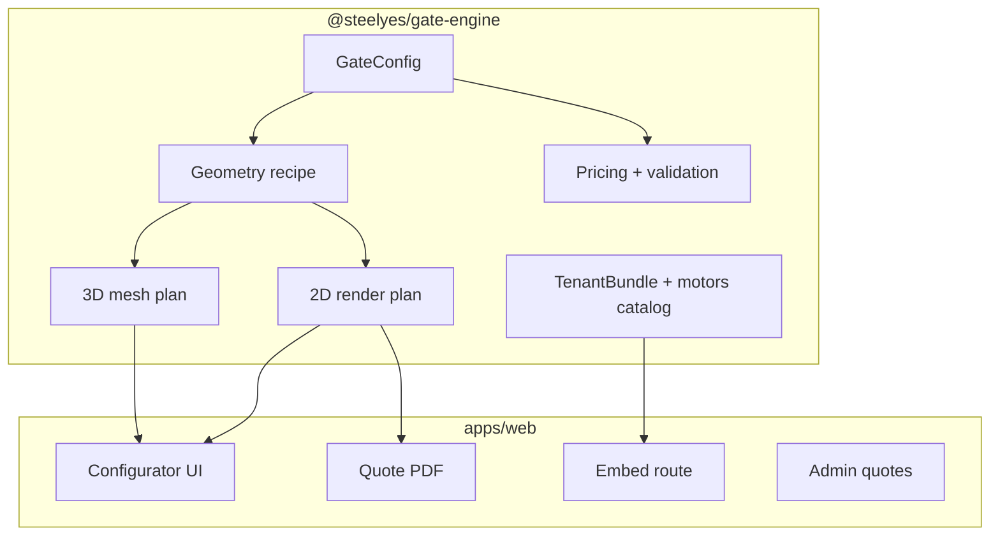

# Configurator V2 Master Plan

**Date:** 2026-05-20  
**Status:** In progress — sprint foundation landed  
**Owner:** Steelyes product + engineering

## North star

Build the best **gate-first, mobile-first, survey-led** configurator for premium UK metal gates — not a MyConfigurator clone. Win on visual fidelity for Victorian double swing, honest pricing, embeddable white-label platform, and a production quote funnel.

## Competitive position

| Area | MyConfigurator | Steelyes V2 target |
|------|----------------|-------------------|
| 3D native | Full scene | On-demand 3D from `@steelyes/gate-engine` mesh recipe |
| Plan view | Yes | **Plan tab** (driveway + leaf sweep schematic) |
| Photo / AR | Yes | Phase 3 — gate-audit driven |
| PDF drawings | Rich | **Technical schematic page** in quote PDF |
| Multi-product | Gate + fence + wicket | **Fence panels step** (v2 skeleton) |
| CPQ / ERP | Deep B2B | Admin quote pipeline first |
| Embed / SaaS | Mature | **`/embed/configurator` + TenantBundle** skeleton |

## Architecture layers

## Phase map

### Phase 1 — Visual truth (this sprint) ✅ foundation

- [x] Procedural 3D mesh with tube cylinders from geometry recipe
- [x] Finials follow arched top curve
- [x] Plan view mode in engine + UI tab
- [x] PDF technical drawing page
- [x] Per-step validation in configurator store
- [x] Fence panels step (UI + engine model)
- [x] Motor catalog module (FAAC / CAME / BFT schematic)
- [x] TenantBundle type + `/embed/configurator` route

### Phase 2 — Quote funnel hardening (next 1–2 weeks)

- [ ] Production deploy + custom domain
- [ ] Resend verified domain + Turnstile on contact
- [ ] Final FROM prices from Marius
- [ ] Railhead variant catalog wired to options UI
- [ ] Share link analytics (PostHog events)
- [ ] Admin: open shared config from quote reference

### Phase 3 — Photo simulation + AR

- [ ] Gate photo overlay using `tools/gate-photo-audit` pipeline
- [ ] QR on PDF → mobile AR preview (WebXR or model-viewer)
- [ ] On-demand 3D load only when user taps 3D tab (bundle split)

### Phase 4 — White-label platform

- [ ] TenantBundle loaded from DB / JSON per installer
- [ ] Branding injection (logo, colours, enabled gate types)
- [ ] Lead routing (email + webhook)
- [ ] iframe embed SDK snippet for partner sites

### Phase 5 — Fabrication depth

- [ ] Cut lists from geometry recipe
- [ ] Workshop PDF with bar counts and rail positions
- [ ] ERP export (CSV / webhooks) — only when CPQ demand proven

## Data still needed (external)

1. Final indicative base prices per gate type × finish
2. Railhead SKU catalog with quantities per width band
3. Arch height rules (900 vs 1000 mm openings)
4. Fence panel pricing model
5. Motor list actually stocked by Steelyes workshop

## Success metrics

- Configurator completion rate (gate → summary → contact)
- Share / PDF download rate
- Mobile vs desktop session split
- Time to first valid quote
- Visual audit score vs real Steelyes gate photos (gate-audit rubric)

## Key files

| Deliverable | Path |
|-------------|------|
| Engine entry | `packages/gate-engine/src/index.ts` |
| Geometry | `packages/gate-engine/src/geometry/` |
| 3D mesh | `packages/gate-engine/src/mesh/` |
| Plan view | `packages/gate-engine/src/rendering/plan-view.ts` |
| Motors | `packages/gate-engine/src/catalog/motors.ts` |
| Tenant | `packages/gate-engine/src/platform/tenant-bundle.ts` |
| Configurator UI | `apps/web/src/components/configurator/` |
| Embed | `apps/web/src/app/embed/configurator/page.tsx` |
| PDF | `apps/web/src/lib/configurator/quote-pdf.ts` |
| Vision | `docs/frontend/CONFIGURATOR_V1_VISION.md` |

## Immediate next actions

1. Run full health check (`pnpm typecheck && pnpm test && pnpm build`)
2. Manual QA: plan tab, 3D pickets, fence step, PDF page 2
3. Update E2E for 6-step flow if fence step changes selectors
4. Commit + deploy preview when ready
