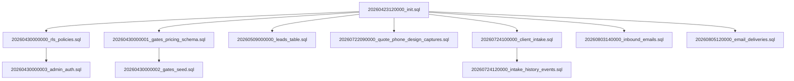

# Supabase Usage Inventory — Steelyes Next.js App

**Investigation Date**: September 19, 2026  
**Purpose**: Assess feasibility of migrating from Supabase Cloud (EU-West-1) to self-hosted Postgres on Coolify  
**Status**: Investigation complete — no implementation performed

---

## Executive Summary

**Can we drop Supabase Cloud entirely and run only Postgres on Coolify?**

### Answer: **PARTIAL — with moderate effort**

The Steelyes app uses:
- ✅ **Postgres database** (via Supabase PostgREST REST API)
- ✅ **Supabase Auth** (JWT-based authentication for admin users)
- ❌ **NOT using**: Storage, Realtime, Edge Functions, or Postgres-specific extensions

### Migration Complexity

**Code changes required**: Moderate  
**Infrastructure changes**: Significant

You have **two migration paths**:

1. **EASY PATH** (env-only + keep PostgREST stack): Deploy self-hosted Supabase stack (Postgres + PostgREST + Kong + GoTrue auth) on Coolify. Update connection strings. ~2-4 hours of DevOps work, zero code changes.

2. **CLEAN PATH** (replace Supabase SDK with direct SQL): Replace `@supabase/supabase-js` and `@supabase/ssr` with `pg` or Drizzle/Prisma, rebuild Auth with JWT middleware, migrate RLS policies to application layer. ~2-4 weeks of development work.

---

## 1. Supabase Client Usage

### 1.1 Client Initialization

**File**: `apps/web/src/lib/supabase/server.ts`

Two client types are used:

#### Server Client (respects RLS, session-aware)
```typescript
import { createServerClient } from '@supabase/ssr'

export async function getServerClient() {
  return createServerClient<Database>(
    env.NEXT_PUBLIC_SUPABASE_URL,
    env.NEXT_PUBLIC_SUPABASE_ANON_KEY,
    { cookies: { ... } }
  )
}
```

- **Used in**: Middleware, admin auth flows
- **Purpose**: Session management + RLS enforcement
- **Key**: `NEXT_PUBLIC_SUPABASE_ANON_KEY` (anon JWT)

#### Service Role Client (bypasses RLS)
```typescript
import { createClient } from '@supabase/supabase-js'

export function getServiceRoleClient() {
  return createClient<Database>(
    env.NEXT_PUBLIC_SUPABASE_URL,
    env.SUPABASE_SERVICE_ROLE_KEY
  )
}
```

- **Used in**: All Server Actions, API routes, cron jobs
- **Purpose**: Admin-level database access (INSERT, UPDATE, SELECT)
- **Key**: `SUPABASE_SERVICE_ROLE_KEY` (service role JWT, bypasses RLS)

### 1.2 Environment Variables

**File**: `apps/web/.env.example`, `apps/web/src/lib/env.ts`

**Required (client + server)**:
- `NEXT_PUBLIC_SUPABASE_URL` — PostgREST endpoint (e.g., `https://[project].supabase.co`)
- `NEXT_PUBLIC_SUPABASE_ANON_KEY` — Public anon JWT

**Required (server only)**:
- `SUPABASE_SERVICE_ROLE_KEY` — Admin JWT (bypasses RLS)
- `RESEND_API_KEY` — Email provider (unrelated to Supabase)

**Optional**:
- `NEXT_PUBLIC_SITE_URL` — Used for email links, not Supabase-specific

### 1.3 Browser vs Server Usage

- **No browser client** — all Supabase calls happen server-side (Server Actions, API routes, middleware)
- **Session management** — handled via Next.js cookies + `@supabase/ssr`
- **TypeScript types** — generated from Supabase schema (`@/types/database.types`)

---

## 2. Supabase Product Features

### 2.1 Postgres Database ✅ USED

**Access method**: REST API via PostgREST (not direct `pg` connection)

**Tables** (26 migrations total):
1. `gates` — Gate catalog (type, style, pricing multipliers)
2. `gate_options` — Configurable options (tubes, finishes, motors, railheads)
3. `fencing_panels` — Fencing catalog
4. `service_zones` — Installation postcodes + surcharges
5. `configurations` — Saved gate designs (JSONB payload)
6. `quote_requests` — Customer quote submissions
7. `leads` — Contact form submissions
8. `design_captures` — "Email me my design" captures (for abandoned-design reminders)
9. `email_deliveries` — Transactional email audit log (Resend webhook updates)
10. `inbound_emails` — Gmail-forwarded direct emails to workshop inbox
11. `admin_audit` — Admin action audit trail (planned, not actively used)
12. `client_intake_sessions` — Token-gated client product-data intake
13. `client_intake_answers` — Per-question answers for intake sessions
14. `client_intake_answer_history` — History log for intake changes
15. `client_intake_events` — Event log for intake workflow

**Custom Enums**:
- `gate_type` — `double-swing`, `sliding`, `bifolding`, `cantilevered`, `sliding-radius`, `telescopic`
- `gate_style` — `modern`, `classic`, `privacy`
- `quote_status` — `new`, `contacted`, `quote_sent`, `won`, `lost`

**Indexes**: Standard B-tree on FK/query columns (no complex GIN/GiST indexes)

### 2.2 Supabase Auth ✅ USED (minimal)

**Authentication model**: Email + password only (no OAuth, magic links, or MFA)

**Usage**:
- **Admin login**: `apps/web/src/app/admin/auth-actions.ts`
  - `supabase.auth.signInWithPassword()` — login form
  - `supabase.auth.signOut()` — logout
  - `supabase.auth.getUser()` — session retrieval

- **Middleware protection**: `apps/web/src/middleware.ts`
  - Checks `user.app_metadata.is_admin` or `user.user_metadata.is_admin`
  - Redirects unauthenticated requests to `/admin/login`

**Admin flag**: Stored in `auth.users.app_metadata.is_admin` (boolean)

**No user registration flow** — admins are created manually in Supabase dashboard.

### 2.3 NOT USED ❌

- **Storage** — No file uploads, no `supabase.storage.*` calls
- **Realtime** — No subscriptions, no `supabase.channel()` calls
- **Edge Functions** — No Deno functions deployed
- **Postgres Extensions** — No pgsodium, pg_cron, pg_net, vector, or other exotic extensions
- **Database triggers** — Only standard `handle_updated_at()` for `updated_at` columns
- **Foreign Data Wrappers** — None
- **Full-Text Search** — Basic text queries only, no `tsvector` columns

---

## 3. Database Operations by Route/Handler

### 3.1 Server Actions (apps/web/src/app/actions.ts)

**File**: `apps/web/src/app/actions.ts`

| Action | Tables | Operation |
|--------|--------|-----------|
| `submitContactForm` | `leads`, `configurations` | INSERT lead, SELECT configuration |
| `submitConfiguratorQuote` | `quote_requests`, `leads`, `configurations` | INSERT quote + lead, SELECT configuration |
| `emailMyDesign` | `design_captures`, `configurations` | UPSERT design capture, SELECT configuration |

### 3.2 Configurator Actions

**File**: `apps/web/src/app/(marketing)/configurator/actions.ts`

| Action | Tables | Operation |
|--------|--------|-----------|
| `saveGateConfiguration` | `configurations` | INSERT new config, return `share_token` |
| `loadGateConfigurationByShareToken` | `configurations` | SELECT config by token |

### 3.3 Admin Actions

**Files**: `apps/web/src/app/admin/*/actions.ts`

| File | Tables | Operations |
|------|--------|-----------|
| `admin/auth-actions.ts` | `auth.users` (via SDK) | `signInWithPassword`, `signOut` |
| `admin/quotes/actions.ts` | `quote_requests`, `configurations` | UPDATE status, SELECT for email |
| `admin/inbox/actions.ts` | `inbound_emails` | UPDATE `handled` flag |
| `admin/gates/actions.ts` | `gates` | UPDATE pricing multipliers |
| `admin/gate-options/actions.ts` | `gate_options` | UPDATE, INSERT options |
| `admin/fencing/actions.ts` | `fencing_panels` | UPDATE, INSERT, DELETE panels |
| `admin/client-data/actions.ts` | `client_intake_sessions`, `client_intake_answers` | UPDATE intake data |

### 3.4 API Routes

**Files**: `apps/web/src/app/api/*/route.ts`

| Route | Tables | Operation | Auth |
|-------|--------|-----------|------|
| `/api/inbox/ingest` | `inbound_emails` | UPSERT email from Gmail script | Bearer token (`INBOX_INGEST_SECRET`) |
| `/api/webhooks/resend` | `email_deliveries` | UPDATE delivery status | Svix signature verification |
| `/api/cron/abandoned-designs` | `design_captures`, `quote_requests` | SELECT captures, UPDATE `reminder_sent_at` | Bearer token (`CRON_SECRET`) |
| `/api/quote/[shareToken]/pdf` | `configurations` | SELECT config for PDF generation | Public (token-gated) |
| `/api/quote/[shareToken]/cut-list` | `configurations` | SELECT config for cut list PDF | Public (token-gated) |
| `/api/ar/models` | (none) | In-memory AR model store | Public |

### 3.5 Middleware

**File**: `apps/web/src/middleware.ts`

- Checks `supabase.auth.getUser()` for `/admin/*` routes
- Enforces `user.app_metadata.is_admin === true` or `user.user_metadata.is_admin === true`
- Redirects to `/admin/login` if unauthenticated or unauthorized

---

## 4. Hard Dependency on Supabase Features

### 4.1 PostgREST REST API

**ALL database queries** use the Supabase JS SDK, which calls PostgREST endpoints:

```typescript
supabase.from('configurations').select('*').eq('share_token', token)
supabase.from('quote_requests').insert({ ... })
supabase.from('gates').update({ ... }).eq('id', id)
```

**This means**:
- No direct `pg` connection strings (`postgresql://...`)
- No Drizzle, Prisma, or raw SQL queries
- All queries go through `https://[project].supabase.co/rest/v1/...`

**To migrate**: Replace SDK calls with direct Postgres queries via `pg` or an ORM.

### 4.2 Row-Level Security (RLS) Policies

**RLS is ENABLED on all tables** but policies are minimal:

#### Public Read Policies (anon key)
- `gates` — `anon_select` (public catalog)
- `service_zones` — `anon_select` (postcode lookup)

#### Public Write Policies (anon key)
- `configurations` — `anon_insert` (save config)
- `quote_requests` — `anon_insert` (submit quote)

#### Service Role Only (bypasses RLS)
- `leads`, `design_captures`, `email_deliveries`, `inbound_emails`, `client_intake_*`, `admin_audit`
- Admin writes: `gates`, `gate_options`, `fencing_panels` via authenticated RLS policies checking `app_metadata.is_admin`

**Migration impact**: RLS enforcement must move to application middleware/route guards.

### 4.3 JWT-Based Authentication

**Auth flow**:
1. User submits email/password to `/admin/login`
2. `supabase.auth.signInWithPassword()` returns JWT
3. JWT stored in HTTP-only cookies via `@supabase/ssr`
4. Middleware validates JWT via `supabase.auth.getUser()`
5. Admin flag checked from `user.app_metadata.is_admin`

**GoTrue (Supabase Auth service)** manages:
- Password hashing (bcrypt)
- JWT signing/verification (HS256)
- Session refresh tokens
- `auth.users` table

**To migrate**: Replace with NextAuth.js, Lucia, or custom JWT middleware + password hashing.

---

## 5. Migration Files

**Location**: `supabase/migrations/`

**26 migration files** (listed chronologically):

1. `20260423120000_init.sql` — Core schema: enums, tables, triggers, RLS
2. `20260430000000_rls_policies.sql` — Public read/write policies
3. `20260430000001_gates_pricing_schema.sql` — `gate_options`, `fencing_panels`
4. `20260430000002_gates_seed.sql` — Initial gate catalog data
5. `20260430000003_admin_auth.sql` — Admin write policies (gates, gate_options, fencing_panels)
6. `20260501000000_auto_schema_reload.sql` — Auto-notify PostgREST on schema changes
7. `20260501000001_notify_schema_reload.sql` — Manual reload trigger
8. `20260501000002_grants.sql` — Service role grants
9. `20260501000003_catchup.sql` — Backfill missing columns
10. `20260501000004_catchup_tables.sql` — Recreate missing tables (idempotent)
11. `20260502120000_admin_rls_app_metadata.sql` — Switch admin flag to `app_metadata`
12. `20260502130000_ensure_gates_name_column.sql` — Add `name` column to `gates`
13. `20260504150000_cleanup_client_pricing_seed.sql` — Remove dev seed data
14. `20260504160000_fencing_delete_grant.sql` — Grant DELETE on `fencing_panels`
15. `20260505154435_fix_pricing_rls_closure.sql` — Fix RLS policy closure bug
16. `20260505160000_fix_pricing_rls_grants.sql` — Correct grants
17. `20260505161000_quote_requests_service_role_grants.sql` — Grant service role full access to `quote_requests`
18. `20260506120000_harden_phase5_grants.sql` — Lock down public schema grants
19. `20260506121000_harden_public_non_dml_grants.sql` — Revoke non-DML operations
20. `20260509000000_leads_table.sql` — Add `leads` table
21. `20260722090000_quote_phone_design_captures.sql` — Add `design_captures`, phone columns
22. `20260722100000_leads_design_captures_service_role_grants.sql` — Service role grants
23. `20260724100000_client_intake.sql` — Client intake tables
24. `20260724120000_intake_history_events.sql` — Intake history + events
25. `20260803140000_inbound_emails.sql` — Add `inbound_emails` table
26. `20260805120000_email_deliveries.sql` — Add `email_deliveries` table

**All migrations are standard SQL** — no Supabase-specific extensions required.

### Schema Creation Order



---

## 6. External Webhooks & Email Integration

### 6.1 Resend Webhook

**Route**: `/api/webhooks/resend`  
**Purpose**: Update `email_deliveries.status` when Resend confirms delivery  
**Dependency**: Writes to `email_deliveries` table — **Postgres only, no Supabase feature**

### 6.2 Gmail Inbox Ingest

**Route**: `/api/inbox/ingest`  
**Purpose**: Log direct emails to `info@steelyes.co.uk` from Google Apps Script  
**Dependency**: Writes to `inbound_emails` table — **Postgres only**

### 6.3 Abandoned Designs Cron

**Route**: `/api/cron/abandoned-designs`  
**Trigger**: Vercel Cron (daily)  
**Purpose**: Email customers who saved a design but didn't request a quote  
**Dependency**: Reads `design_captures`, `quote_requests` — **Postgres only**

**All webhooks/cron jobs only need database access** — no Supabase-specific APIs.

---

## 7. Migration Effort Estimate

### 7.1 Easy Path: Self-Hosted Supabase Stack

**Keep**: PostgREST + Kong + GoTrue (Supabase Auth)  
**Change**: Connection strings only

#### Infrastructure Setup
1. Deploy Postgres 15+ on Coolify (or use existing Coolify DB)
2. Deploy PostgREST + Kong + GoTrue containers (official Supabase Docker Compose)
3. Run all 26 migrations against new Postgres instance
4. Configure GoTrue JWT secrets + SMTP for auth emails (if needed)
5. Update env vars:
   - `NEXT_PUBLIC_SUPABASE_URL` → `https://postgrest.your-coolify.com`
   - Generate new JWT secrets for anon/service role keys
   - Keep `SUPABASE_SERVICE_ROLE_KEY` (just a new JWT)

#### Code Changes
**ZERO** — app continues using `@supabase/supabase-js` SDK, just pointed at self-hosted stack.

#### Effort
- **DevOps**: 2-4 hours (Docker Compose setup, DNS, SSL)
- **Testing**: 2-4 hours (verify auth, RLS, webhooks)
- **Risk**: Low (same API surface, just self-hosted)

#### Pros
✅ Fastest migration path  
✅ Zero code changes  
✅ Keep RLS enforcement at database layer  
✅ Keep Supabase Auth (GoTrue) — no custom JWT logic

#### Cons
❌ Still running PostgREST + Kong (infrastructure overhead)  
❌ Locked into Supabase stack (harder to migrate away later)  
❌ No direct SQL access (still REST API)

---

### 7.2 Clean Path: Replace SDK with Direct SQL

**Remove**: `@supabase/supabase-js`, `@supabase/ssr`, PostgREST, GoTrue  
**Replace**: `pg` or Drizzle/Prisma + NextAuth.js or custom JWT

#### Code Changes Required

1. **Replace Supabase client with Postgres client** (20 files)
   - `apps/web/src/app/actions.ts`
   - `apps/web/src/app/(marketing)/configurator/actions.ts`
   - All `apps/web/src/app/admin/*/actions.ts` files
   - All `apps/web/src/app/api/*/route.ts` files

   **Example migration**:
   ```typescript
   // BEFORE (Supabase SDK)
   const { data, error } = await supabase
     .from('configurations')
     .select('*')
     .eq('share_token', token)
     .maybeSingle()

   // AFTER (pg or Drizzle)
   const result = await db.query(
     'SELECT * FROM configurations WHERE share_token = $1 LIMIT 1',
     [token]
   )
   ```

2. **Replace Auth system** (3 files)
   - `apps/web/src/lib/supabase/server.ts` — remove Supabase client, add `pg` pool
   - `apps/web/src/app/admin/auth-actions.ts` — replace with NextAuth or custom JWT
   - `apps/web/src/middleware.ts` — replace `supabase.auth.getUser()` with NextAuth session or JWT verify

3. **Migrate RLS policies to application layer**
   - Current: RLS enforced at database (anon key = limited access, service role = full access)
   - New: Application middleware checks user role before queries
   - **26 RLS policies** to translate into route guards

4. **Replace session management**
   - Current: `@supabase/ssr` manages cookies + session refresh
   - New: NextAuth.js or custom JWT middleware + `jose` library

5. **Update TypeScript types**
   - Current: `npx supabase gen types` → `@/types/database.types`
   - New: Drizzle schema or manual types

#### Infrastructure Changes
1. Deploy Postgres 15+ on Coolify
2. Run all 26 migrations
3. Set up connection pooling (PgBouncer or Supabase connection pooler)
4. Configure `DATABASE_URL` env var
5. Remove PostgREST + Kong containers

#### Effort
- **Backend refactor**: 3-5 days (replace SDK calls, test queries)
- **Auth migration**: 2-3 days (NextAuth setup, session logic)
- **RLS → middleware**: 2-3 days (route guards, permission checks)
- **Testing**: 3-5 days (E2E, admin flows, webhooks)
- **Total**: ~2-4 weeks

#### Pros
✅ Direct SQL access (faster, more flexible)  
✅ Remove PostgREST dependency  
✅ Standard Postgres tooling (pgAdmin, migrations)  
✅ Easier to switch DB providers later

#### Cons
❌ High development effort  
❌ RLS enforcement now in application code (easier to miss a guard)  
❌ Manual session management (unless using NextAuth)

---

## 8. Recommended Migration Path

**For Coolify deployment**: **EASY PATH** (self-hosted Supabase stack)

**Rationale**:
1. **Zero code changes** — minimal risk, fastest deployment
2. **Keep RLS enforcement** — database-level security is safer than app-level
3. **Proven stack** — self-hosted Supabase is battle-tested (used by many orgs)
4. **Incremental migration** — can later migrate to direct SQL if needed

**When to use CLEAN PATH**:
- If you're already planning a DB architecture overhaul
- If you need sub-10ms query latency (PostgREST adds ~5ms overhead)
- If you want to consolidate to a single Postgres instance (no sidecar services)

---

## 9. Open Questions / Risks

### 9.1 Connection Pooling
- **Current**: Supabase provides PgBouncer (transaction pooling)
- **Self-hosted**: Need to deploy PgBouncer or Supavisor (Supabase's pooler)
- **Impact**: Without pooling, Next.js serverless functions will exhaust Postgres connections

### 9.2 GDPR Compliance
- **Current**: Supabase EU-West-1 guarantees data residency (locked by ADR 001)
- **Self-hosted**: Coolify server must be in EU region
- **Verification**: Check Coolify deployment region before migration

### 9.3 Backups
- **Current**: Supabase automated daily backups (7-day retention on free tier)
- **Self-hosted**: Must configure `pg_dump` cron or WAL archiving
- **Risk**: Data loss if backup strategy not implemented

### 9.4 Schema Migrations
- **Current**: `supabase migration up` applies migrations via CLI
- **Self-hosted**: Need migration runner (e.g., `psql -f`, Flyway, or custom script)
- **Solution**: Run migrations manually or via CI/CD pipeline

### 9.5 Admin User Migration
- **Current**: Admin users stored in `auth.users` (Supabase Auth)
- **Self-hosted GoTrue**: Must migrate `auth.users` + `auth.identities` tables
- **Clean Path**: Create new admin users in custom auth table

### 9.6 Email Delivery for Auth
- **Current**: Supabase sends auth emails (password reset, etc.) — not used in Steelyes
- **Self-hosted**: GoTrue needs SMTP config if auth emails are enabled later
- **Impact**: None (Steelyes doesn't use password reset flow)

---

## 10. Conclusion

**Yes, you can drop Supabase Cloud** — but keep the Supabase stack (Postgres + PostgREST + GoTrue) self-hosted.

**Migration checklist**:
1. ✅ Postgres database → easy (standard SQL migrations)
2. ✅ Auth → easy (self-host GoTrue or replace with NextAuth)
3. ✅ RLS policies → easy (keep PostgREST or migrate to app layer)
4. ❌ Storage, Realtime, Edge Functions → not used (no migration needed)

**Recommended next steps**:
1. Provision Postgres 15+ on Coolify (EU region)
2. Deploy self-hosted Supabase stack (Docker Compose: `supabase/postgres`, `postgrest/postgrest`, `supabase/gotrue`, `kong`)
3. Run all 26 migrations against new DB
4. Update env vars in Coolify app config
5. Test admin login, quote submission, webhook routes
6. Monitor connection pooling (add PgBouncer if needed)
7. Set up automated backups (`pg_dump` to S3/Backblaze)

**Estimated cutover downtime**: 1-2 hours (DNS + env var updates + smoke tests)

---

## Appendix A: All Files Using Supabase

### Server Actions
- `apps/web/src/app/actions.ts`
- `apps/web/src/app/(marketing)/configurator/actions.ts`
- `apps/web/src/app/admin/auth-actions.ts`
- `apps/web/src/app/admin/gates/actions.ts`
- `apps/web/src/app/admin/gate-options/actions.ts`
- `apps/web/src/app/admin/quotes/actions.ts`
- `apps/web/src/app/admin/fencing/actions.ts`
- `apps/web/src/app/admin/client-data/actions.ts`
- `apps/web/src/app/admin/inbox/actions.ts`

### API Routes
- `apps/web/src/app/api/inbox/ingest/route.ts`
- `apps/web/src/app/api/webhooks/resend/route.ts`
- `apps/web/src/app/api/cron/abandoned-designs/route.ts`
- `apps/web/src/app/api/quote/[shareToken]/pdf/route.ts`
- `apps/web/src/app/api/quote/[shareToken]/cut-list/route.ts`

### Middleware & Lib
- `apps/web/src/middleware.ts`
- `apps/web/src/lib/supabase/server.ts`
- `apps/web/src/lib/env.ts`
- `apps/web/src/lib/admin/require-admin.ts`
- `apps/web/src/lib/admin/user-is-admin.ts`

### Admin Pages (read-only queries)
- `apps/web/src/app/admin/quotes/page.tsx`
- `apps/web/src/app/admin/gates/page.tsx`
- `apps/web/src/app/admin/gate-options/page.tsx`
- `apps/web/src/app/admin/fencing/page.tsx`
- `apps/web/src/app/admin/inbox/page.tsx`
- `apps/web/src/app/admin/listino/page.tsx`

### Client Intake (admin-only)
- `apps/web/src/lib/client-intake/session.ts`

### Tests
- `apps/web/tests/e2e/helpers/supabase-config.ts`
- `apps/web/tests/e2e/configurator.spec.ts`

---

## Appendix B: Database Schema (Core Tables)

```sql
-- Core tables (simplified)
configurations (id, share_token, gate_type, parameters:jsonb, created_at)
quote_requests (id, first_name, last_name, email, phone, postcode, configuration_id, status, created_at)
leads (id, name, email, phone, project_type, postcode, message, status, created_at)
design_captures (id, email, configuration_id, share_token, reminder_sent_at, created_at)
gates (id, type, style, base_price_per_m2, tube_multipliers:jsonb, finish_multipliers:jsonb, created_at)
gate_options (id, option_type, code, label, gate_types:jsonb, price_impact, created_at)
fencing_panels (id, name, description, base_price, created_at)
email_deliveries (id, resend_email_id, kind, recipient, status, created_at)
inbound_emails (id, gmail_thread_id, from_email, subject, category, received_at, created_at)
```

---

**Investigation completed. No code changes made.**  
**Document generated**: `docs/supabase-usage-inventory.md`
